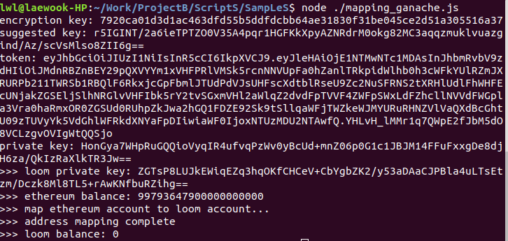
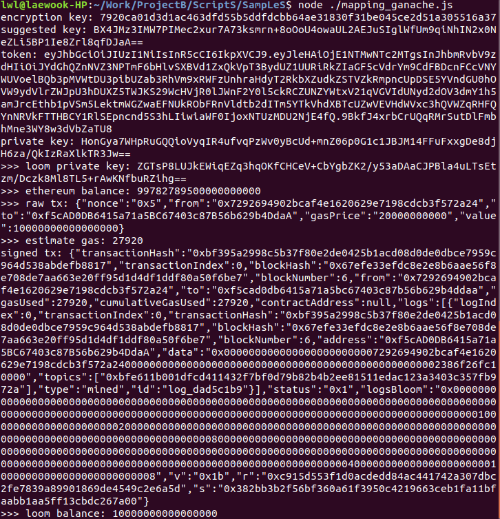

# cold_wallet_import.js
- 이더리움 월렛 저장 샘플
  

# cold_wallet_export.js
- 이더리움 월렛 로드 샘플
  

# mapping_ganache.js
 - 로컬 ganache 노드와 로컬 loom 노드 매핑 샘플
 - 이미 매핑이 되어 있는 상태라면 0.01이더(=10000000000000000웨이)를 룸 노드로 전송한다
 - ganache 노드와 로컬 loom 노드를 구동후 실해해야 한다
  ```bash
  $ ./FirstNetwork.sh start_ganache #ganache 노드 생성및 게이트웨이 컨트렉트디플로이
  $ ./FirstNetwork.sh start_loomnetwork #loom노드 생성및 토큰 컨트렉트디플로이
  $ #참고) 이더 전송에 수 초 이상의 시간이 소요된다
  ```
  
  
