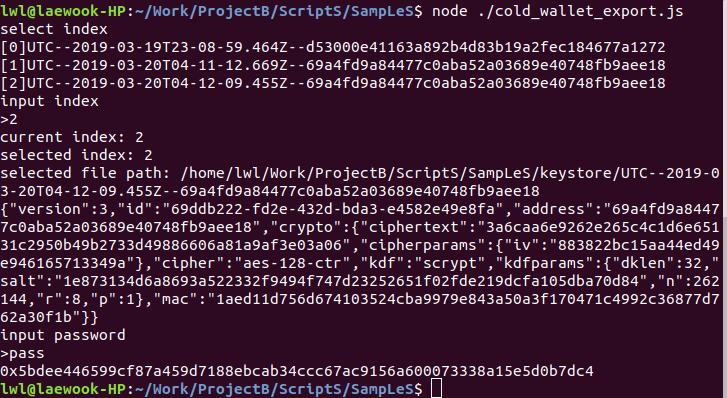

# cold_wallet_import.js
- 이더리움 월렛 저장 샘플
- 이더리움 테스트넷 private key 생성 정보는 https://metamask.io/ 참고
  

# cold_wallet_export.js
- 이더리움 월렛 로드 샘플
  

# mapping_ganache.js
- 로컬 ganache 노드와 로컬 loom 노드 매핑 샘플
- 이미 매핑이 되어 있는 상태라면 0.01이더(=10000000000000000웨이)를 loom 노드로 전송한다
- ganache 노드와 로컬 loom 노드를 구동후 실해해야 한다
  ```bash
  $ ./FirstNetwork.sh start_ganache #ganache 노드 구동및 게이트웨이 컨트렉트를 디플로이
  $ ./FirstNetwork.sh start_loomnetwork #loom노드 구동및 토큰 컨트렉트를 디플로이
  $ #참고) 이더 전송에 수 초 이상의 시간이 소요된다
  ```
  
  

# mapping_geth.js
- 로컬 이더리움 노드와 로컬 loom 노드 매핑 샘플
- ganache 기본 어카운트가 아닌 로컬 이더리움의 keystore를 사용 하는 것 외에는 mapping_ganache.js와 동일
  ```bash
  $ ./FirstNetwork.sh start_geth #로컬 이더리움 노드 구동
  $ cd TruffLeGateWay/
  $ yarn deploy:geth #로컬 이더리움 노드에 게이트웨이 컨트렉트를 디플로이
  $ ./FirstNetwork.sh start_loomnetwork #loom노드 구동및 토큰 컨트렉트를 디플로이
  ```
  

# mapping_rinkeby.js
- 이더리움 테스트넷과 로컬 loom 노드 매핑 샘플
- 게이트웨이 컨트렉트를 이더리움 테스트넷에 디플로이 한 뒤, 로컬 loom 노드를 구동한다
  ```bash
  $ cd TruffLeGateWay/
  $ vi rinkeby.json
  ```
  ```
  {"api_token":"XXXXXXXXXXXXXXXXXXXXXXXXXXXXXXXX","private_key":"0xXXXXXXXXXXXXXXXXXXXXXXXXXXXXXXXXXXXXXXXXXXXXXXXXXXXXXXXXXXXXXXXX"}
  ```
- api_token 생성 정보는 https://infura.io/docs 참고
  ```
  $ yarn deploy:rinkeby #이더리움 테스트넷에 게이트웨이 컨트렉트를 디플로이
  $ cd ../
  $ ./FirstNetwork.sh start_loomnetwork #loom노드 구동및 토큰 컨트렉트를 디플로이
  ```
  

# mapping_extdev-plasma-us1.js
- 이더리움 테스트넷과 loom 테스트넷 어카운트 매핑 샘플
- 이미 이더리움 테스트넷에 디플로이되어 있는 게이트웨이 컨트렉트 주소와 인터페이스(Gateway.json)만 사용한다
  

# widthdraw_from_extdev-plasma-us1.js
- loom 네트워크의 이더를 게이트웨이를 통해 이더리움으로 전송(2단계)하는 샘플
- 최종 게이트웨이에서 자신의 어카운트로 전송 될 때 수수료가 지급된다
- 게이트웨이에 잔고가 없으면, loom 네트워크의 잔고 중 0.01이더를 게이트웨이로 전송
- 게이트웨이데 잔고가 있으면, 전액 이더리움으로 전송
- 이미 이더리움 테스트넷에 디플로이되어 있는 게이트웨이 컨트렉트 주소와 인터페이스(Gateway.json)만 사용한다
  
  ```
  loom 네트워크 => 이더리움 게이트웨이
  ```
  
  ```
  이터리움 게이트웨이 => loom 어카운트에 매핑된 이더리움 어카운트
  전송 요청 후, 주기적으로 게이트웨이의 잔고를 체크 한 결과 약 2~3분 가량 소요
  ```

# btoken_rinkeby.js
- 토큰 컨트렉트를 로컬 이더리움에 디플로이 한 후 테스트
- ganache 도 어카운트 프라이빗 키만 변경해 주면 똑같이 테스트 가능
  ```bash
  $ cd TruffLeBToken/
  $ yarn deploy:rinkeby #이더리움 테스트넷에 토큰 컨트렉트를 디플로이
  ```
  
