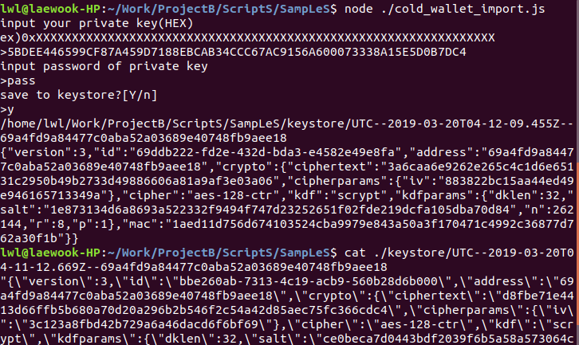

# cold_wallet_import.js
- 이더리움 월렛 저장 샘플
- 이더리움 테스트넷 private key 생성 정보는 https://metamask.io/ 참고
  

# cold_wallet_export.js
- 이더리움 월렛 로드 샘플
  

# mapping_ganache.js
- 로컬 ganache 노드와 로컬 loom 노드 매핑 샘플
- 이미 매핑이 되어 있는 상태라면 0.01이더(=10000000000000000웨이)를 loom 노드로 전송한다
- ganache 노드와 로컬 loom 노드를 구동후 실해해야 한다
  ```bash
  $ ./FirstNetwork.sh start_ganache #ganache 노드 구동및 게이트웨이 컨트렉트를 디플로이
  $ ./FirstNetwork.sh start_loomnetwork #loom노드 구동및 토큰 컨트렉트를 디플로이
  $ #참고) 이더 전송에 수 초 이상의 시간이 소요된다
  ```
  
  

# mapping_geth.js
- 로컬 geth 노드와 로컬 loom 노드 매핑 샘플
- ganache 기본 어카운트가 아닌 geth의 keystore를 사용 하는 것 외에는 mapping_ganache.js와 동일
  ```bash
  $ ./FirstNetwork.sh start_geth #ganache 노드 구동
  $ cd TruffLeGateWay/
  $ yarn deploy:geth #게이트웨이 컨트렉트디플로이
  $ ./FirstNetwork.sh start_loomnetwork #loom노드 구동및 토큰 컨트렉트를 디플로이
  ```
  

# mapping_rinkeby.js
- 이더리움 테스트넷과 로컬 loom 노드 매핑 샘플
- 게이트웨이 컨트렉트를 이더리움 테스트넷에 디플로이 한 뒤, 로컬 loom 노드를 구동한다
  ```bash
  $ cd TruffLeGateWay/
  $ vi rinkeby.json
  ```
  ```
  {"api_token":"XXXXXXXXXXXXXXXXXXXXXXXXXXXXXXXX","private_key":"0xXXXXXXXXXXXXXXXXXXXXXXXXXXXXXXXXXXXXXXXXXXXXXXXXXXXXXXXXXXXXXXXX"}
  ```
- api_token 생성 정보는 https://infura.io/docs 참고
  ```
  $ yarn deploy:rinkeby #이더리움 테스트넷에 게이트웨이 컨트렉트를 디플로이
  $ cd ../
  $ ./FirstNetwork.sh start_loomnetwork #loom노드 구동및 토큰 컨트렉트를 디플로이
  ```
  

# mapping_extdev-plasma-us1.js
- 이더리움 테스트넷과 loom 테스트넷 어카운트 매핑 샘플
- loom 테스트넷을 위한 게이트웨이 컨트렉트는 이미 디플로이되어 있으므로, 컨트렉트 주소와 인터페이스(Gateway.json)만 사용한다
  
